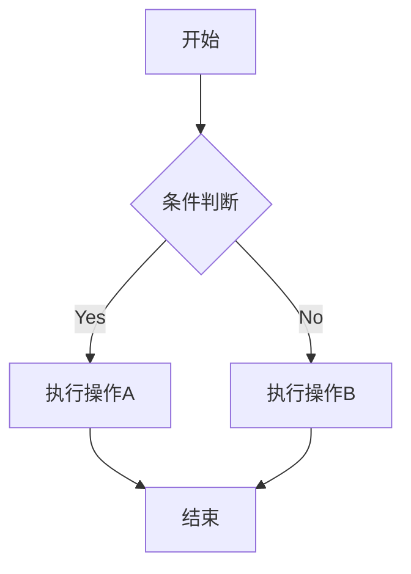
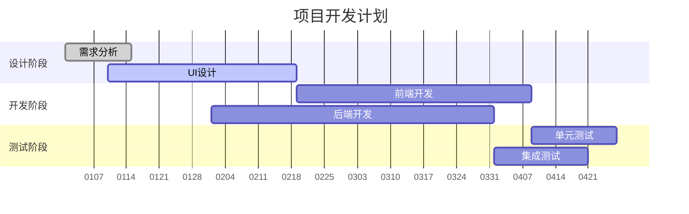
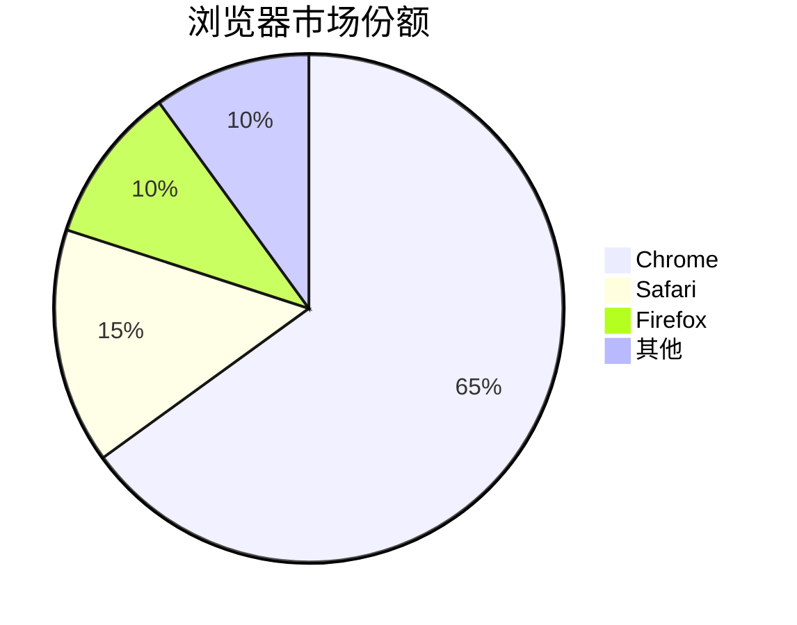
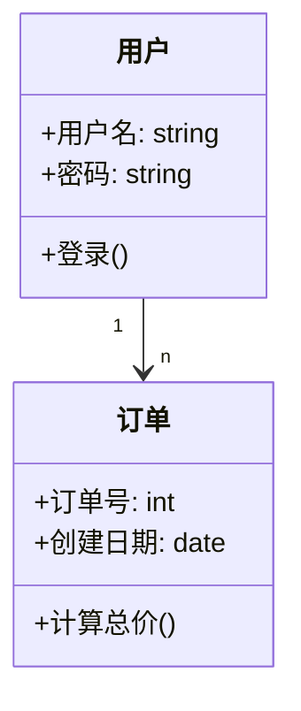
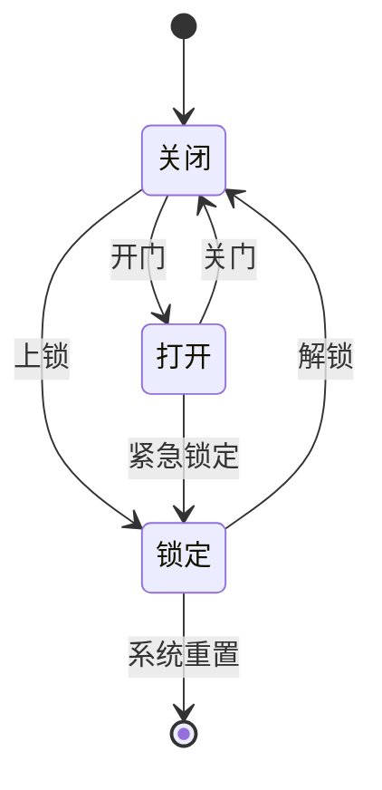
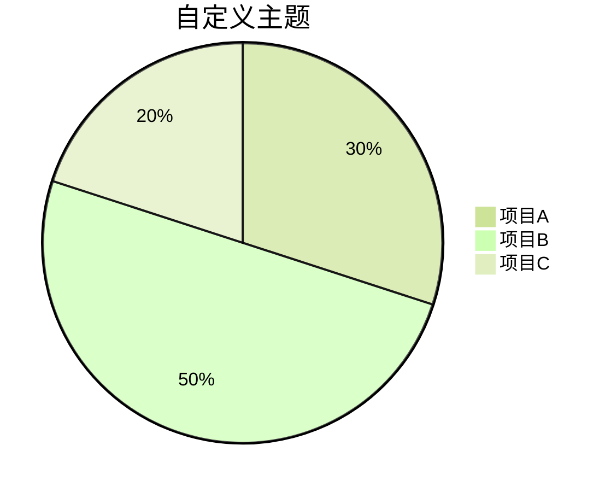
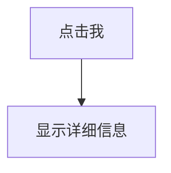

# Markdown图表绘制
## 常见的Markdown图表绘制工具
Mermaid 支持通过文本语言生成各种图表：

- 流程图 (Flowchart)
- 序列图 (Sequence Diagram)
- 类图 (Class Diagram)
- 状态图 (State Diagram)
- 甘特图 (Gantt Chart)
- 饼图 (Pie Chart)

## 流程图

### 流程图方向
TD 或 TB：从上到下
BT：从下到上
RL：从右到左
LR：从左到右

### 流程图嵌套
```mermaid
graph TB
  %% 外层子图 A
  subgraph A[A类]
    direction TB  %% 子图内部方向
    a1[a1小类]
    a2[a2小类]
    end

  %% 外层子图 B
  subgraph B[B类]
    direction TB
    b1[b1小类]
    b2[b2小类]
    end

    a1 --> b2 & a2
  ```

### 节点形状
A`[方形]`：矩形
B`(圆角矩形)`：圆角矩形
C`{菱形}`：菱形（决策）
D`((圆形))`：圆形
E`>旗帜形]`：旗帜形

### 连接线类型
`---` 实线
`-.-` 虚线
`===` 粗实线
`-->` 实线箭头
`-.->` 虚线箭头
`==>` 粗实线箭头

## 时序图与甘特图
### 时序图
```mermaid
sequenceDiagram
    participant A as 用户
    participant B as 系统
    participant C as 数据库
    
    A->>B: 登录请求
    B->>C: 验证用户信息
    C-->>B: 返回验证结果
    B-->>A: 登录成功/失败
```
时序图语法要点：
- `participant` 定义参与者
- `->>` 实线箭头
- `-->>` 虚线箭头
- `note` 添加注释

### 甘特图

甘特图语法要点：
- `title` 设置标题
- `dateFormat` 定义日期格式
- `axisFormat` 定义X轴格式
- `section` 定义阶段
- 任务状态：done（已完成）、active（进行中）、crit（关键）

## 饼图



## 类图
类图用于面向对象设计，展示类及其关系。


类图语法要点：
- 定义关系：
  - `<|--` 继承（子类指向父类）
  - `..|>`实现（类指向接口）
  - `-->` 关联（单向关联）
  - `--` 双向关联
  - `o--` 聚合（整体-部分，部分可独立）
  - `*--` 组合（整体-部分，同生共死）
  - `..>` 依赖
- 在类内部
  - `+` 表示 public
  - `-` 表示 private
  - `#` 表示 protected。

## 状态图


状态图基本语法:
- 使用 stateDiagram-v2或 stateDiagram（兼容旧版）。
- [*] 表示起点或终点。
- 状态用文字描述，可以换行或使用复合状态。

# 高级技巧
## 主题定制



## 交互式图表


